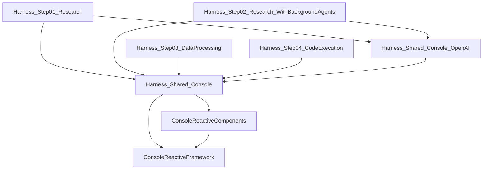

# 專案總覽(繁體中文)

> Microsoft Build 2026 — **BRK243: Claw and Agent Harness in Microsoft Foundry** session 範例程式總說明。
> 本文件說明 `src/` 下三個專案的用途、具體功能、技術堆疊與執行方式。各原始檔內另有繁體中文導讀註解(`【檔案說明】` 區塊)。

## 三個專案一覽

| 專案 | 用途 | 技術 | 部署/執行 |
|---|---|---|---|
| [`Agent-Harness`](#agent-harness) | 用 Microsoft Agent Framework 的 **HarnessAgent** 打造互動式 console agent 的四階段教學範例 | .NET 10、`Microsoft.Agents.AI` 1.7.0、OpenAI Responses API | 本機 `dotnet run`,連 Azure AI Foundry 專案 |
| [`Hermes-Foundry`](#hermes-foundry) | 把 **Hermes TUI** 的後端託管到 Azure AI Foundry,成為長時間執行的 hosted agent | Python 3.12、`azure-ai-agentserver`(Invocations Protocol)、Bicep | `azd up` 部署容器到 Foundry |
| [`Workstream-Manager-Autopilot`](#workstream-manager-autopilot) | 進駐 Teams 的 **Agent 365(A365)工作流管理 agent**:追蹤工作項目、回答 workstream 問題 | .NET 9、`Microsoft.Agents`(A365)、OpenAI Responses API、M365 MCP、Azure Table Storage | `azd up` 部署到 Foundry,經 Bot Service 發布到 Teams |

三者合起來呈現 session 的主軸:**多代理系統的三種形態** —— 本機互動式 agent(Agent-Harness)、雲端託管的長時間 agent(Hermes-Foundry)、嵌入 M365 協作場景的企業 agent(Workstream Manager)。

---

## Agent-Harness

四個可執行範例(Step01–04)逐步疊加 HarnessAgent 的能力,搭配四個共用程式庫。`AsHarnessAgent()` 一行就能把任意 `IChatClient` 升級成具備規劃、待辦、記憶、工具核准等能力的完整 agent —— 每個 Step 範例只需要寫 instructions 與差異化設定。

### 專案相依關係



### 可執行範例(Step01–04)

| Step | 主題 | 開啟的能力 | 教學重點 |
|---|---|---|---|
| **Step01 Research** | 互動式研究助理 | Todo、plan/execute 模式、FileMemory、ToolApproval、WebSearch + 自訂 `WebBrowsingTool` | 規劃工作流程(計畫 → 核准 → 執行)、結構化輸出、SSRF 防護的網頁瀏覽工具、HTML→Markdown 轉換 |
| **Step02 Background Agents** | 父子代理協作 | `BackgroundAgents`(其餘大多關閉) | 父 agent 把股價查詢委派給背景 WebSearchAgent **並行**執行:啟動所有任務 → 等待 → 取回 → 彙整 → 清除 |
| **Step03 Data Processing** | 資料分析助理 | `FileAccessStore`(其餘大多關閉) | 以 `FileAccess_*` 工具讀寫 `working/` 資料夾的 CSV(附 `sales.csv` 範例資料),把 agent 的世界限制在一個本機目錄 |
| **Step04 Code Execution** | 全功能 + 程式碼執行 | **全部開啟** + `HyperlightCodeActProvider` + skills | 在 Hyperlight micro-VM 沙箱執行 Python(`execute_code`)、檔案式 skill 探索(附 `regex-tester` skill)。需要 KVM 等虛擬化支援 |

每個 Step 都支援斜線指令:`/exit`,Step01/04 另有 `/todos`、`/mode`,以及 `/session-export`、`/session-import`(session 存檔/讀檔)。

### 共用程式庫

| 程式庫 | 角色 | 關鍵類別 |
|---|---|---|
| `ConsoleReactiveFramework` | 借用 React props/state 概念的 console UI 元件框架 | `ConsoleReactiveComponent<TProps,TState>`(值相等比較跳過重繪)、`KeyEventListener` / `ConsoleResizeListener`(16ms 輪詢的事件來源) |
| `ConsoleReactiveComponents` | 具體 UI 元件 | `TextScrollPanel`(串流輸出的增量渲染,核心技巧)、`TextInput`、`ListSelection`、`TopBottomRule`、`AnsiEscapes`(DECSTBM scroll region 等 VT100 工具) |
| `Harness_Shared_Console` | 互動 console 的核心基礎設施 | `HarnessConsole`(進入點)、`HarnessAgentRunner`(對話迴圈)、`HarnessAppComponent`(主畫面)、**Observers**(串流生命週期擴充點:工具顯示、核准、規劃、用量⋯)、**CommandHandlers**(斜線指令)、**ToolFormatters**(工具呼叫顯示的責任鏈)、`HarnessTracing`(OpenTelemetry 寫檔) |
| `Harness_Shared_Console_OpenAI` | OpenAI Responses API 專屬 observers | `OpenAIResponsesWebSearchDisplayObserver`(顯示搜尋過程)、`OpenAIResponsesErrorObserver`(failed/incomplete/content filter 明細) |

架構上最值得讀的三條線:

1. **Observer 模式**:`ConsoleObserver` 的五個回呼時機點(ConfigureRunOptions → OnResponseUpdate → OnContent → OnText → OnStreamComplete),所有顯示邏輯都是 observer,互不耦合。
2. **FollowUpAction 機制**:observer 在串流結束後回傳「要問使用者的問題」或「直接附進下一輪的訊息」,由 Runner 統一協調 —— 工具核准、plan 模式的澄清/核准問題都靠這個機制,UI 不需要阻塞式輸入。
3. **plan/execute 雙模式**:plan 模式強制 agent 以 `PlanningResponse` JSON schema 結構化輸出(用 C# 型別 + `[Description]` 定義 prompt),核准後切到 execute 模式串流執行。

### 執行方式

```powershell
# 先決條件:.NET 10 SDK、az login(DefaultAzureCredential)
$env:AZURE_AI_PROJECT_ENDPOINT = "https://<your-project>.services.ai.azure.com/api/projects/<your-project-name>"
$env:AZURE_AI_MODEL_DEPLOYMENT_NAME = "gpt-5.4"   # 未設定時預設 gpt-5.4

dotnet run --project .\src\Agent-Harness\Harness_Step01_Research\Harness_Step01_Research.csproj
```

執行後會在輸出目錄產生 `traces_*.log`(OpenTelemetry span,含完整 HTTP 請求/回應內容),是觀察 agent 行為的第一手資料。

---

## Hermes-Foundry

**用途**:proof-of-concept,把現有的 Hermes(React/Ink terminal UI)後端搬上 Azure AI Foundry hosted agents —— TUI 留在本機,agent 邏輯與檔案狀態活在雲端的 per-user sandbox。

### 具體功能

- **JSON-RPC 隧道**:TUI 經 Invocations Protocol 送 `{"kind":"hermes.rpc","request":{...}}`,agent 轉送給容器內以 stdin/stdout 管線溝通的 Hermes gateway 子行程(`tui_gateway.entry`)。
- **事件串流與斷線續傳**:`session.events` 走 SSE;每個 session 有 `_EventBuffer` 環形緩衝區,事件帶單調遞增 seq,client 斷線後用 `since_seq` 續傳並可偵測 replay gap。
- **Per-user session 隔離**:Foundry 依 Entra 身分(OID hash)配發 session,每位使用者有自己的持久 sandbox 與 `~/.hermes` 狀態。
- **每日維護 routine 自動佈建**(`routine_provisioner.py`):agent 收到第一次 RPC 時,用 managed identity 呼叫 Foundry Routines REST API,替該 session 建立(或修復)`hermes-maint-<hash>` 每日排程;fire-and-forget、冪等、失敗有冷卻(RBAC 拒絕 30 分鐘、暫時性錯誤 5 分鐘)。
- **維護結果回送**:routine 觸發 `{"kind":"hermes.maintenance"}` → 結果寫入 `history.jsonl`,session 在線就即時推 `maintenance.summary` 事件,離線則下次連線時補發(以 delivery key 去重)。

### 主要檔案

| 檔案 | 內容 |
|---|---|
| `agent/main.py` | 進入點:`InvocationAgentServerHost` + `HermesChildBroker`(子行程生命週期、RPC 路由)+ `handle_invoke` 分流 |
| `agent/routine_provisioner.py` | 維護 routine 的自動佈建(stdlib `urllib` + `DefaultAzureCredential`) |
| `agent/Dockerfile`、`agent/agent.manifest.yaml` | Python 3.12 容器(非特權使用者、port 8088)、agent 藍圖(invocations v1.0.0、Entra 隔離) |
| `infra/main.bicep` + `infra/core/**` | AI Foundry 專案、模型連線、ACR、儲存體、Bing/AI Search grounding |
| `azure.yaml` | azd 服務定義;postdeploy hook 幫 agent 的 managed identity 加 `Cognitive Services OpenAI User` 角色 |

### 部署與注意事項

```bash
# 1. 先初始化 Hermes submodule(third_party/hermes 預設是空的)
./scripts/init-hermes.sh
# 2. 部署
azd up
```

主要環境變數:`HERMES_FOUNDRY_PROJECT_ENDPOINT`(或 `AZURE_AI_PROJECT_ENDPOINT`)、`HERMES_FOUNDRY_AGENT_NAME`、`HERMES_FOUNDRY_MAINTENANCE_CRON` / `_TIMEZONE`、`HERMES_FOUNDRY_DISABLE_ROUTINE_AUTOPROVISION`;子行程相關:`HERMES_GATEWAY_SRC_ROOT`、`HERMES_GATEWAY_PYTHON`、`HERMES_CHILD_HOME`。完整清單見專案 `README.md`。

---

## Workstream-Manager-Autopilot

**用途**:Microsoft Agent 365 agent,進駐 Teams 群組聊天與 1:1 對話,扮演「工作流自動駕駛」:被動捕捉團隊承諾事項、管理工作項目、回答以對話歷史為基礎的 workstream 問題。

### 具體功能

- **工作項目追蹤**:`create_work_item` / `list_work_items` / `update_work_item` / `close_work_item` 四個 function 工具,存 Azure Table Storage(PartitionKey = `tenantId:agentUserId`),每筆異動寫入 changelog。
- **被動捕捉(autopilot)**:訊息「不是」對 agent 說的也會掃描是否含承諾事項;捕捉到就建工作項目 + 對原訊息貼 📌 reaction,**不發任何文字**(silent capture)。一般回覆則貼 👍(📌 與 👍 互斥,📌 優先)。
- **三道存取閘門**(全部是 deterministic 罐頭回應,擋在 LLM 之前):跨租戶拒絕 → 1:1 限 manager 與 allowlist(manager 用 `/access add/remove/list` 管理)→ 群組聊天要求所有參與者都已核准。
- **「在跟我說話嗎?」判斷**(`AddressedToAgentGate`):明確 @mention、1:1、email 直接回;群組聊天的模糊情況交給輕量 LLM judge 做 YES/NO。
- **M365 整合**:Responses API 原生 MCP 掛載 Word、Excel、Mail、Calendar、OneDrive/SharePoint 工具(`ToolingManifest.json` 或 Agent365 API 動態探索);Email 與文件註解通知也有對應 handler。
- **指令**:`/access`(名單管理)、`/onboarding`(manager 首次設定)、`/workstreamsummary run`(工作流摘要)。

### 架構與主要檔案

```
Teams/M365 → Bot Service → POST /api/messages
  → A365AgentApplication(activity 路由 + at-least-once 去重)
    → ResponsesApiAgentLogicService(存取閘門 → addressed 判斷 → LLM)
      → ResponsesApiClient(Responses API + MCP + function 工具迴圈)
      → WorkItemToolHandler(工具執行 + 📌)/ ReactionService(Graph setReaction)
      → WorkItemService(Azure Table Storage)
```

| 檔案 | 內容 |
|---|---|
| `src/workstream_manager_agent/Program.cs` | ASP.NET Core 主機:Key Vault、Agent SDK、A365 Kairo tracing、App Insights、`/api/messages` |
| `AgentLogic/A365AgentApplication.cs` | activity 總路由(Teams 訊息、Email/Word/Excel/PowerPoint 通知、安裝事件) |
| `AgentLogic/AgentInstructions.cs` | system prompt(工作項目規則、silent capture、Teams 行為約束) |
| `AgentLogic/ResponsesApi/ResponsesApiAgentLogicService.cs` | 業務邏輯管線(七步驟,見檔內註解) |
| `AgentLogic/ResponsesApi/Helpers/*` | 存取控制、addressed 閘門、Responses API client、工作項目工具、reaction、Teams 工具 |
| `Services/AgentTokenHelper.cs` + `AgentTokenCredential.cs` | A365 agentic user identity 的三段式 token 取得(blueprint → instance → user federated) |
| `infra/main.bicep` + `infra/modules/*` | AI Services、Foundry 專案、ACR、Bot Service、兩個 Table Storage、agent blueprint 建立指令碼 |

### 部署與設定

```bash
azd up   # postprovision hook 會授權並發布 agent
```

主要組態(`appsettings.json` / 環境變數):`AzureOpenAIEndpoint`、`ModelDeployment`(預設 `gpt-5-chat`)、`WorkItemsTableServiceUri` / `WorkItemsTableName`、`DirectMessageAllowListTableServiceUri`、`AgentDisplayNameAliases`(使用者 @mention 的別名)、`GroupChatUnauthorizedResponse` / `CrossTenantUnauthorizedResponse`(支援 `{Manager}`、`{UnauthorizedParticipants}` 占位符)、`EnableKairoTracing`、`McpDiscoverySource`(`API` 或 `Manifest`)。

---

## 三個專案的對照速覽

| 面向 | Agent-Harness | Hermes-Foundry | Workstream-Manager |
|---|---|---|---|
| Agent 形態 | 本機互動式 console agent | 雲端 hosted agent(TUI 在本機) | M365 內嵌的企業 agent |
| 核心 SDK | Microsoft Agent Framework(HarnessAgent) | azure-ai-agentserver(Invocations) | Microsoft.Agents(A365)+ raw Responses API |
| 人機互動 | console 串流 + 追問/核准選單 | Hermes TUI(JSON-RPC over SSE) | Teams 訊息 + emoji reactions |
| 狀態保存 | AgentSession(可序列化)+ file memory | Foundry per-user sandbox 檔案系統 | Azure Table Storage |
| 長時間執行 | session export/import | Foundry Routines(每日維護) | Bot Service 常駐 + 被動監聽 |
| 安全邊界 | 工具核准、SSRF 防護、Hyperlight 沙箱 | Entra per-user 隔離、managed identity | 三道存取閘門、租戶隔離、agentic user token |
